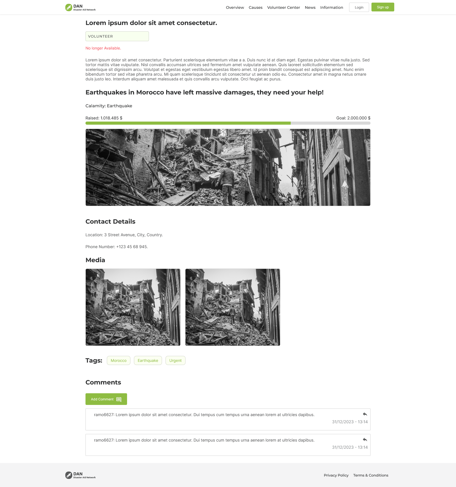

# DAN : Projet fin de module

Le projet DAN est une application web dont le but est aider les victimes des catastrophes naturelles

## Auteurs

- [Omar Aharrar](https://github.com/omar6627m)

- [Zakaria Ouazzani](https://github.com/zakariaouazzanirahoui)

- [Mohamed Ben jouad](https://github.com/miko24)


## Description
L'application web doit etre basée sur l'architecture micro services et single page application avec angular.
L'application support les fonctionnalités suivantes : 

  - Assistance
  - Aides (Financier, Logistique, etc)
  - Volontariat
  - Expression du besoin
  - Logistique et distribution des aides ( par Map )

En plus de la partie web app le projet est dévelopé sur un systeme DEVOPS constitué par les composants suivant : 

  - Github : Online repository for the microservices
  - Jenkins : Pipeline configurer for the automatic building and deployment of the microservises
  - Docker : Image and container builder for the microservices
  - Ansible : IaaS provider for executing commandes on a VPS
  - Kubernetes : Container orchestrator to deploy the microservices

L'architecture du systeme DEVOPS est representé comme tel : 


## Architecture DevOps

L'architecure DevOps sert à facilité le deployement et l'integration des microservices aprés le developement d'une version d'un microservice, Le workflow the cette architecture suit la procédure suivantes : 

   - Github push : Le developpeur push une nouvelle version d'un microservice au niveau de github

  

   - Jenkins webhook : Jenkins reçois une alerte webhook qui va activer un pipeline configurer pour le microservice demandé

  

   - Jenkins build : Jenkins se charge de lançer un build qui va preparer l'image du microservice et lançer un script ansible pour demander au serveur kubernetes de pull l'image visé.

   

   - Docker build: Docker est appelé par jenkins afin de builder une image pour un microservice specific

  

   - Gitea repository : L'image créer par docker sera pushé au niveau d'un repository privé gitea

   

   - Ansible script : Jenkins va ensuite lançer un script ansible qui se chargera de deployer la nouvelle version du microservice

  ```
- hosts: 34.175.119.161
   remote_user: mohamed_benjouad
   tasks:
     - name: Apply yaml
       command: Kubctl apply usermicroservice.yml
     - name: Deploy new version
       command: kubectl patch deployment usermicroservice -p "{"spec":{"template":{"metadata":{"labels":{"date":"date +'%s'"}}}}}"

  ```

   - kubernetes deployement : Ansible va appliqué un fichier yaml qui decrit le deployment du microservice

   


Aprés ses étapes le microservice est finalement déployé au niveau de kubernetes est diponible dependament du port spécifié par le fichier yaml correspondant.


## Les microservices
    
Nos microservices sont sauvegarder au niveau du repository suivant : [microservices](https://github.com/zakariaouazzanirahoui/spring-root)

Chaque microservice est connecté à ça propre base de données, nous avont utilisé postgresql afin de sauvegarder des informations tel que celles des utilisateurs, feed etc... On a aussi utilisé la base de données MinIO pour la sauvegarde des images


Chaque microservices est constitué par les fichiers suivant : 
   
```
    ├── src : source files
│   ├── .gitignore : ignoring some files and folders
│   ├── Dockerfile : image build configuration
│   ├── mvnw : executable mvn for windows
│   └── pom.xml : information file
```

On site les microservices 

   - Discovery service : 

Discovery service map les noms des microservices existants au URL correspondant


  - Gateway service 

Gateway service set à router des requetes http au services visé par le client

  - Users microservices

Users microservices sert à gerer la gestion des utilisateurs comme :  l'authentification , CRUD , la generation et validation des tokens .

   - Feed microservices

Feed microservices sert à gerer les files d'actualité dependament du type souhaité par le client (gestion pour different category )

diagramme de classe : 


## Front end

Le front end est developpé utilisant la technology angular, celui-ci suit est une single page application qui pour afficher les données souhaité, fait appelle au different endpoint creé par les microservices spring-boot.

Le front end est sauvegardé au niveau du repository suivant : [Font end](https://github.com/omar6627m/DAN-Frontend)

Voici quelques screenshot du web app : 

  - Page d'accueil: 


  - Page des causes:


  - Page de volontariat: 


  - Page admin:


  - Page des details d'un poste:



  - Page des details d'une cause:


  